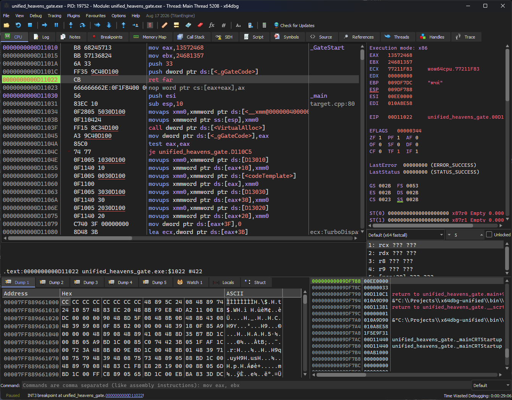
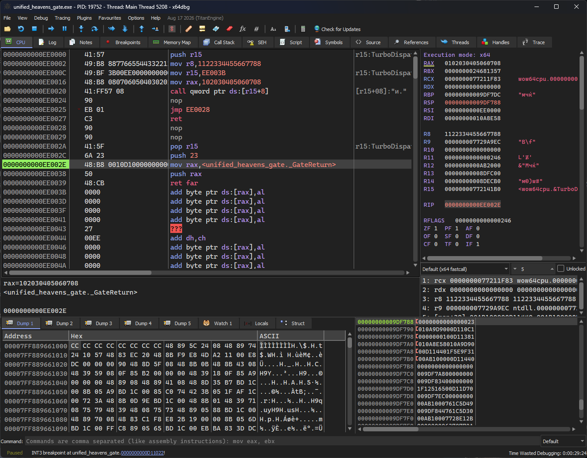

# x64dbg-unified


A unified x86/x64 debugger for Windows, based on
[x64dbg](https://github.com/x64dbg/x64dbg). One 64-bit debugger process can
follow a WOW64 thread as it switches between 32-bit compatibility mode and
64-bit long mode.

> **Project status:** experimental fork. This project is not an official
> x64dbg release. Keep the original x32/x64 builds available when working on
> targets where maximum compatibility is required.

## Why a unified build?

Official x64dbg uses two debugger executables: x32dbg for 32-bit targets and
x64dbg for 64-bit targets. That model works for ordinary applications, but a
WOW64 process is not always purely 32-bit. It can execute 64-bit code through
Heaven's Gate and later return to x86 code without starting another process.

A debugger selected only from the executable's PE type cannot correctly
represent both sides of that transition. It can read the wrong thread context,
decode x64 bytes as x86 instructions, display the wrong registers, calculate
an incorrect stack width, or resume from the wrong instruction boundary after
a breakpoint.

x64dbg-unified keeps the debugger host and its address type 64-bit, then
selects the stopped thread's execution mode at runtime:

- `CS=0x23`: x86 compatibility mode using `WOW64_CONTEXT`;
- `CS=0x33`: x64 long mode using native `CONTEXT`.

The active disassembler, register view, stack view, expressions, branch
navigation, stepping logic, and breakpoint handling follow that runtime mode.

## One process, both execution modes

The screenshots below show the same WOW64 debuggee and the same x64dbg host
before and after a Heaven's Gate transition. The CPU view switches its
instruction decoder, register set, and pointer width without restarting or
changing the debugger.

### x86 compatibility mode



### x64 long mode



## Build

Use a recursive clone because the repository contains submodules, including a
forked TitanEngine with the required WOW64 fixes.

```powershell
git clone --recursive https://github.com/colby57/x64dbg-unified.git
cd x64dbg-unified
cmake -B build-x64 -G Ninja -DCMAKE_BUILD_TYPE=RelWithDebInfo -DCMAKE_UNITY_BUILD=ON
cmake --build build-x64
```

The unified debugger is produced at:

```text
bin/x64/x64dbg.exe
```

The project uses the same Windows build prerequisites as upstream x64dbg. See
the [official compilation guide](https://github.com/x64dbg/x64dbg/wiki/Compiling-the-whole-project)
for toolchain setup.

## Tests

Build the test targets, then run the TitanEngine suite:

```powershell
cmake --build build-x64 --target x64dbg_tests
py src/tests/run.py --arch x64 --engine TitanEngine
```

The current unified branch passes the complete x64 TitanEngine test set,
including dedicated WOW64 and Heaven's Gate regressions.

To run only the mixed-mode tests:

```powershell
py src/tests/run.py --arch x64 --engine TitanEngine unified_wow64_basic unified_heavens_gate
```

## Relationship to x64dbg

x64dbg-unified is a focused experimental fork of the upstream
[`development`](https://github.com/x64dbg/x64dbg/tree/development) branch. The
goal is to evaluate a single runtime-aware debugger host without replacing the
established x32/x64 distribution model prematurely.

For bugs specific to runtime mode switching, WOW64 contexts, or Heaven's Gate,
open an issue in this fork. For general x64dbg questions and upstream behavior,
use the [official x64dbg repository](https://github.com/x64dbg/x64dbg).

## Credits

- Original debugger and GUI: [x64dbg contributors](https://github.com/x64dbg/x64dbg/graphs/contributors)
- Debugger core: [TitanEngine Community Edition](https://github.com/x64dbg/TitanEngine)
- Disassembly: [Zydis](https://zydis.re)
- Assembly: [XEDParse](https://github.com/x64dbg/XEDParse) and [asmjit](https://github.com/asmjit)
- Import reconstruction: [Scylla](https://github.com/NtQuery/Scylla)

The unified work builds on the original project and its community. Full
upstream credits, sponsors, and historical acknowledgements are available in
the [official x64dbg README](https://github.com/x64dbg/x64dbg#readme).

## License

Licensed under the GNU General Public License v3.0. See [LICENSE](LICENSE).
